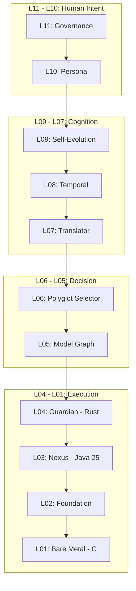

# [ COBALT Engineering Log 0x00 ]
## The Genesis

*It's 3:00 AM. I'm staring at my Arch config. My "smart" workspace feels dumb. Everything is a wrapper of a wrapper. I want the metal.*

---

## The Problem That Wouldn't Leave Me Alone

I've been building software for years. Every stack I've touched eventually hits the same wall: **you're using the wrong tool for the job**.

- You need speed? Use C. Now you have segfaults.
- You need safety? Use Rust. Now you have a 3-month onboarding time.
- You need AI? Use Python. Now you have the GIL screaming at you every time you touch threads.

And don't get me started on AR systems. They're slow, bloated, and built by people who've never had to optimize past a `pip install`. My workspace knows I'm here (face detection), knows what I'm doing (activity tracking), but can't do anything useful with it. **It's data porn without agency.**

I want my computer to *act* on what it knows. I want intent → execution with no friction.

---

## The Eureka (And 20 Coffees Later)

What if we stopped pretending one language can do everything?

What if we built an 11-layer system where **every layer uses the tool that was *made* for its job?**



That's when I started drawing. And I couldn't stop.

---

## Why These 9 Languages

**Rust** — The Guardian. Paranoid memory safety. Every buffer gets verified before the next layer touches it.

**C** — The Mechanic. Raw NVIDIA hooks. Wayland compositor access. No drivers between me and the GPU.

**Java 25** — The Nexus. Project Panama is finally fast enough to be the FFI bridge without JNI overhead.

**Python** — The Researcher. AI models, intent parsing, rapid prototyping. It lives in L05.

**Elixir** — The Medic. BEAM VM fault tolerance. When something crashes, the system heals itself.

**Haskell** — The Logic. Formal verification. Mathematically proven state transitions.

**Julia** — The Scientist. Parallel matrix operations. Spatial physics calculations.

**Go** — The Dispatcher. Async networking. API gateway. High-speed orchestration.

**Lua** — The Ghost. Hot-swappable scripts. Inject behavior without rebuilds.

---

## The Repo Structure (Hub and Spoke)

COBALT is the command center. The specialists live in their own repos:

```
project-cobalt     → The blog + vision (this repo)
nexus              → Java 25 Panama Bridge (L03) [GitHub]
pyprobe           → Memory pinning anchor [GitHub]
pyjx              → Java-Python FFI bridge [GitHub]
rust-guardian     → Integrity layer (L04) [future]
c-mechanic        → Metal layer (L01) [future]
```

Each specialist is a first-class citizen. COBALT links them together.

---

## First Attempt: Just Use gRPC

*Narrator: It didn't work.*

The first version of Nexus tried gRPC for Python interop. It was clean. It was simple. It was **slow**.

Every call meant serialization, TCP stack overhead, and copying bytes through the kernel. For a system targeting AR latency, this was death.

The gRPC experiment lasted one week. That's a story for [Log 0x03: The Pivot](./0x03-NEXUS-RESTART.md) — where I realized Python's memory model was the real enemy.

---

## The CIS Standard (Teaser)

Before I pass out from caffeine overdose, here's what I'm designing:

- **Control signals:** Protobuf over Unix Domain Sockets
- **Data payloads:** Shared memory via `Arena.ofShared()` (Java 25 FFM API)
- **Latency target:** Zero-copy. No kernel stack. No serialization tax.

---

## Status

Coffee: Empty  
Vodka: Next  
Sanity: Questionable  

**This is Project COBALT. Let's see if I actually push code tomorrow.**

---

*The full journey: [See all logs in the Engineering Log index](../index.md)*