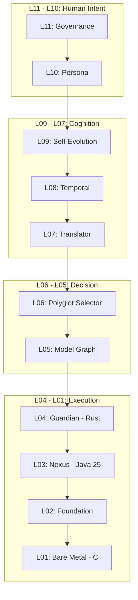

# [ COBALT Engineering Log 0x00 ]
## The Genesis

*3:00 AM. Staring at my Arch config. My "smart" workspace feels like a dumb brick. Everything is a wrapper of a wrapper. I want the actual metal beneath this.*

---

## The Problem That Wouldn't Leave Me Alone

I've been building software for years. Every stack I've touched eventually hits the same wall: **you're using the wrong goddamn tool for the job**.

- You need speed? Use C. Now you have segfaults. Welcome to the void.
- You need safety? Use Rust. Now you have a 3-month onboarding time. Enjoy your borrow checker enlightenment.
- You need AI? Use Python. Now you have the GIL screaming at you every time you touch threads. Have fun with that.

And don't even get me started on AR systems. They're slow. They're bloated. They're built by people who've never had to optimize past a `pip install`. My workspace knows I'm here (face detection), knows what I'm doing (activity tracking), but can't do JACK with it. **It's data porn without agency. Eye candy with no hands.**

I want my computer to *act* on what it knows. I want intent → execution with no friction. I want to think "do the thing" and the thing happens without 47 layers going "hmm let me translate that into this format then call this API then wait for this response then..."

---

## The Eureka (And 20 Coffees Later)

What if we stopped pretending one language can do everything?

What if we built an 11-layer system where **every single layer uses the tool that was *made* for its specific job?**



That's when the drawing started. And it wouldn't stop. I filled a notebook. Then another. My desk looks like a conspiracy theory board. There's red string everywhere.

This might be the most ambitious thing I've ever thought about doing. It might also be complete insanity. Probably both. Doesn't matter — I can't stop thinking about it.

---

## Why These 9 Languages

**Rust** — The Guardian. Paranoid memory safety. Every buffer gets verified before the next layer touches it. If Rust says it's safe, it's safe. No jokes.

**C** — The Mechanic. Raw NVIDIA hooks. Wayland compositor access. No drivers between me and the GPU. I want to touch the metal. The actual metal.

**Java 25** — The Nexus. Project Panama is finally here. Finally. FFI without JNI overhead. It's been a long wait but the future is now.

**Python** — The Researcher. AI models, intent parsing, rapid prototyping. Lives in L05 where it belongs. Not the boss, just the brain.

**Elixir** — The Medic. BEAM VM fault tolerance. When something crashes, the system heals itself. Phoenix Rising from the ashes — literally.

**Haskell** — The Logic. Formal verification. Mathematically proven state transitions. If it compiles, it's correct. There's no other option.

**Julia** — The Scientist. Parallel matrix operations. Spatial physics calculations. Numbers go brrrrr in parallel. Beautiful.

**Go** — The Dispatcher. Async networking. API gateway. High-speed orchestration. Goes fast, stays fast, doesn't crash.

**Lua** — The Ghost. Hot-swappable scripts. Inject behavior without rebuilds. Like a ninja. You never see it, but it gets things done.

---

## The Repo Structure (Hub and Spoke)

COBALT is the command center. The specialists live in their own repos, each doing their own thing, coming together when needed:

```
project-cobalt     → The blog + vision (this repo)
nexus              → Java 25 Panama Bridge (L03) [GitHub]
pyprobe           → Memory pinning anchor [GitHub]
pyjx              → Java-Python FFI bridge [GitHub]
rust-guardian     → Integrity layer (L04) [future]
c-mechanic        → Metal layer (L01) [future]
```

Each specialist is a first-class citizen. COBALT orchestrates. That's the dream.

---

## First Attempt: Just Use gRPC

*Narrator: It didn't work. Obviously.*

The first version of Nexus tried gRPC for Python interop. Clean. Simple. **Slow as hell.**

Every call meant serialization. TCP stack overhead. Copying bytes through the kernel. For a system targeting AR latency — actual usable AR, not "wait 2 seconds for your overlay" — this was death.

The gRPC experiment lasted one week. That's a story for [Log 0x03: The Pivot](/Project-COBALT/logs/0x3-nexus-restart) — where I figured out Python's memory model was the actual enemy all along.

---

## The CIS Standard (Before I Pass Out)

Before I fall asleep face-first into my keyboard, here's what's coming:

- **Control signals:** Protobuf over Unix Domain Sockets
- **Data payloads:** Shared memory via `Arena.ofShared()` (Java 25 FFM API)
- **Latency target:** Zero-copy. No kernel stack. No serialization tax. Just raw data flowing between runtimes like it should.

---

## Status

Coffee: Empty. Dead. Gone.  
Vodka: Next. Obviously.  
Sanity: Questionable. Has been for years.  

**This is Project COBALT. 11 layers. 9 languages. One mission. Let's see if I actually push code tomorrow. Probably won't. But the plan exists now. That's something.**

---

*The full journey: [See all logs in the Engineering Log index](/Project-COBALT/logs)*