# [ COBALT Engineering Log 0x08 ]
## Nexus Resurfaces — The New Architecture

*April 11, 2026. Four months since Nexus first sparked. Three months since I pivoted and admitted I was wrong. Today: the resurrection.*

---

## The Comeback

After the December pivot — after I burned Nexus down and said "this isn't working, we need PyProbe first" — Nexus went quiet. Dark. Dormant.

The foundation had to come first. PyProbe. PyJX. The pieces that actually make inter-language communication POSSIBLE.

Today: Nexus lives again. DIFFERENT than before. SMARTER than before. Built on top of things that WORK instead of things I wished would work.

**Latest commits:**
- [nexus - update](https://github.com/Soumyadeep-Chakravarti/Nexus/commit/4d13c365d43e2ba3d1a6edfa015f8e7d0a2564fc)
- [nexus - update](https://github.com/Soumyadeep-Chakravarti/Nexus/commit/a26a87d84c15d5e4f7b023fe6f192dfd2916b66f)

Not just "it's alive" commits. Real architecture commits. Code that KNOWS what it's supposed to do now.

---

## The New Architecture

Nexus is no longer trying to solve everything. It's no longer the guy who thinks he can do everyone's job and then fails at all of them. It's a **specialist**. It does ONE thing and does it WELL:

```mermaid
flowchart LR
    COBALT["🔷 COBALT"] --> Nexus["☕ Nexus"]
    Nexus --> PyJX["🐍 PyJX"]
    Nexus --> Guardian["🦀 Guardian"]
    PyJX --> PyProbe["🦀 PyProbe"]
    
    style COBALT fill:#12121a,stroke:#00d4ff
    style Nexus fill:#12121a,stroke:#00d4ff
    style PyJX fill:#12121a,stroke:#00d4ff
    style Guardian fill:#12121a,stroke:#666
    style PyProbe fill:#12121a,stroke:#00d4ff
```

Nexus doesn't touch Python memory directly anymore. That was the OLD way. The BROKEN way. The way that led to segfaults at 3 AM and existential crisis about whether this project was even possible.

NOW: Nexus delegates. It says "hey PyJX, give me that Python object" and PyJX says "here's a stable pointer from PyProbe, have fun" and Nexus GOES. No fighting. No crashing. No screaming at my screen.

---

## What's Different

The OLD Nexus assumed:
- "I'll handle Python memory myself" — NO YOU WON'T, YOU CAN'T, YOU'RE NOT SMART ENOUGH
- "JNI is the enemy, Panama solves everything" — PANAMA SOLVES NATIVE MEMORY, NOT PYTHON MEMORY, THESE ARE DIFFERENT THINGS

The NEW Nexus KNOWS:
- Python memory is PyProbe's job (the specialist for that specific thing)
- Nexus talks to PyJX for Python objects (one layer of indirection, ALWAYS)
- Panama handles *native* memory, not CPython internals (sticking to what it actually does well)

This is what happens when you learn from failure. When you hit the wall enough times that you finally understand WHY the wall exists and HOW to go around it instead of trying to smash through it like a crazy person.

---

## Project COBALT

And TODAY — this specific day — **Project COBALT** officially exists as the orchestrating vision.

It's not just Nexus. It's not just PyProbe. It's not just PyJX.

COBALT is:
- Nine language specialists (Rust, C, Java, Python, Elixir, Haskell, Julia, Go, Lua)
- Eleven layers of abstraction (L11 down to L01)
- One mission: remove friction between intent and execution. Think it. Do it. No 47 layers of translation in between.

Nexus is L03. The spine. But the body is MUCH bigger than the spine. The spine is important but it's not the whole thing. It's not even most of the thing. It's just the thing that holds everything together.

---

## Status

Nexus: Resurrected. Different architecture. Better architecture.  
PyProbe: Stable. X-Ray complete. Working.  
PyJX: Alpha. Bridging Python-Java. Getting there.  
COBALT: Born. TODAY. The vision has a NAME now.

**The pieces are coming together. The vision is clear. The path is mapped. Time to build. Actually build. Not just think about building. BUILD.**

---

*Previous: [Log 0x07: PyProbe — Full Type Support](/Project-COBALT/logs/0x7-pyprobe-extractors)*  
*Next: [Log 0x09: The Great GitHub Actions Debacle](/Project-COBALT/logs/0x9-github-deploy)*